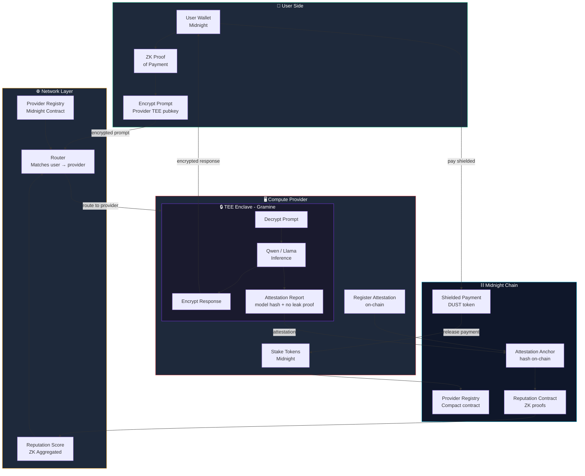

# ZKai Architecture



## Flow Summary

1. **User** encrypts prompt with provider's TEE public key + generates ZK payment proof
2. **Router** matches user to best provider (reputation + stake + availability)
3. **TEE Enclave** decrypts, runs Qwen inference, re-encrypts — operator sees nothing
4. **Attestation** posted on Midnight — proves correct model ran, no data leaked
5. **Payment** released from shielded escrow to provider on Midnight

## Key Privacy Guarantees

| What | How |
|------|-----|
| Prompt hidden from provider | TEE encryption |
| Response hidden from network | End-to-end encryption |
| Identity hidden from chain | Midnight shielded tx |
| Payment amount hidden | DUST shielded transfer |
| Correct model proven | TEE attestation + on-chain hash |
```
